# Music to Wallet

## Visualizations

- Goal is to create a dashboard so that the user could easily visualize the song attributes and its effects on the popularity score

- This was the initial step in our project as we wanted to see which attribute would have the most impact on the popularity score

- Dashboard at the bottom of the "Visualizations.ipynb" has 4 tabs

1) Popularity by Year and Genres - See the recency bias effect between year and popularity
2) Genre Attributes on Popularity - Broad 3D visualizations on popularity to attributes
3) Song Attributes on Popularity - Heat maps to show the overall trend between popularity and song attributes
4) Customizing Attributes - Allows the user to play around with visualizing the data/ grouped by popularity and year

## Modeling

### Preparation

- Songs created before 1960 had very low popularity score so removed from dataset

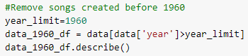
- Only columns which clearly respresnted the songs were used

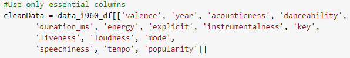
- We splited data into 14 input X values to predict 1 output y value

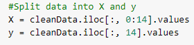
- Used Standard scaler to scale and transfrom X

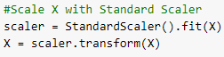

### Process

- Initailized Neural Networks with 4 hidden layes

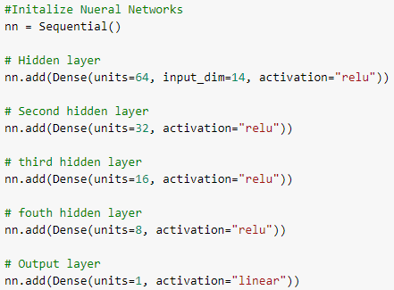
- Compiled & Fitted Model

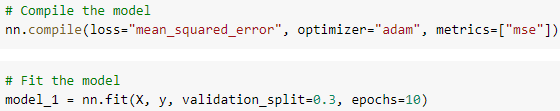

### Analyze
- Model statistic shows a p-value less that 0.05

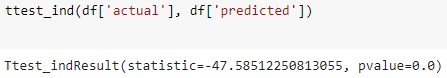
- Plot show loss getting lesser in Trainning

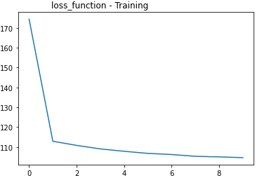
- Plot show loss between Training & Testing

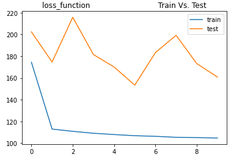
- Actual popularity vs Predited popularity from model is closer

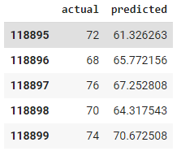

### Model Comparison - Classification Types
- Ran our test/train data for four classification type models:
    1. Deep Learning
    2. Gradient Boosting
    3. Decision Trees
    4. Random Forest

- Ran summary statistics to receive an accuracy score for each model

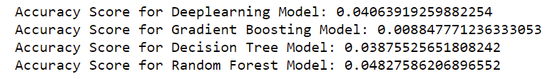
- Most accurate model was Random Forest

### Model Comparison - Scaler Types
- Similarly to the step above, ran our test/train data for four Scaler Types:
    1. MinMax
    2. Standard
    3. RobustScaler
    4. QuantileTransformer

- Ran summary statistics to receive an accuracy score for each scaler

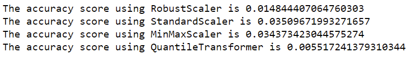
- Most accurate model was StandardScaler

## Relationship between Popularity Rank and Revenue

- Collected data manually by choosing a sample of 5 songs from each popularity score category
- Spotify pay-per-stream: up to $0.00437
- Apple pay-per-stream: up to $0.00735

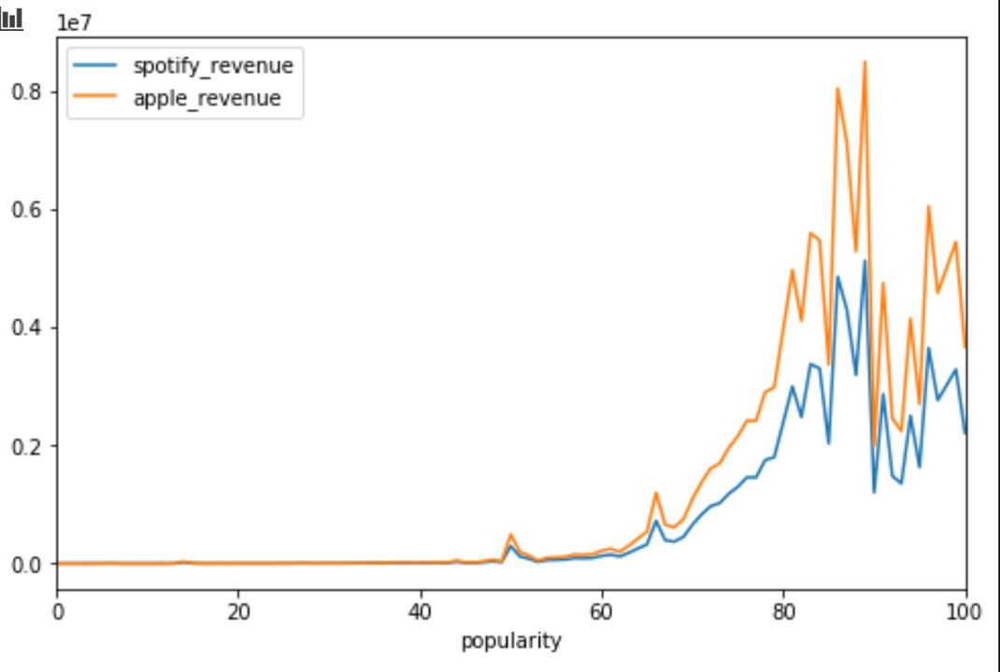

### Data Observations

The following are some interesting observations that can only be explained by Spotify's secret algorithm for popularity scores.

- Some songs that have well-known artists but a lesser play count still seem to receive higher popularity scores. 
Ex: Wabash Cannonball by Johnny Cash - play count 521,601. Other songs with popularity score 40 had 1.6-2.4M plays

- Holiday Music has a much greater # of plays than other songs with the same popularity score. 
Ex: Let it Snow! Let it Snow! Let it Snow! had 306M plays while others with the same popularity score of 50 had around 6-11M plays

- Multiple songs with the same title (cover music, featuring other artists.)  This was most prevalent with classical music and seasonal or holiday music

- Multiples of the same songs repeated in different albums/collections - many have different play counts

### Predictions
- Created a revenue prediction widget to utilize our model
- Key audio features can be adjusted by sliders
- Deep learning model is executed by a button press
- The popularity score is converted to a dollar amount and displayed
- Musicians and record producers could utilize this tool to fine tune
  audio features and maximize streaming revenue from Spotify
  
  
     **Revenue Prediction Widget**
  
  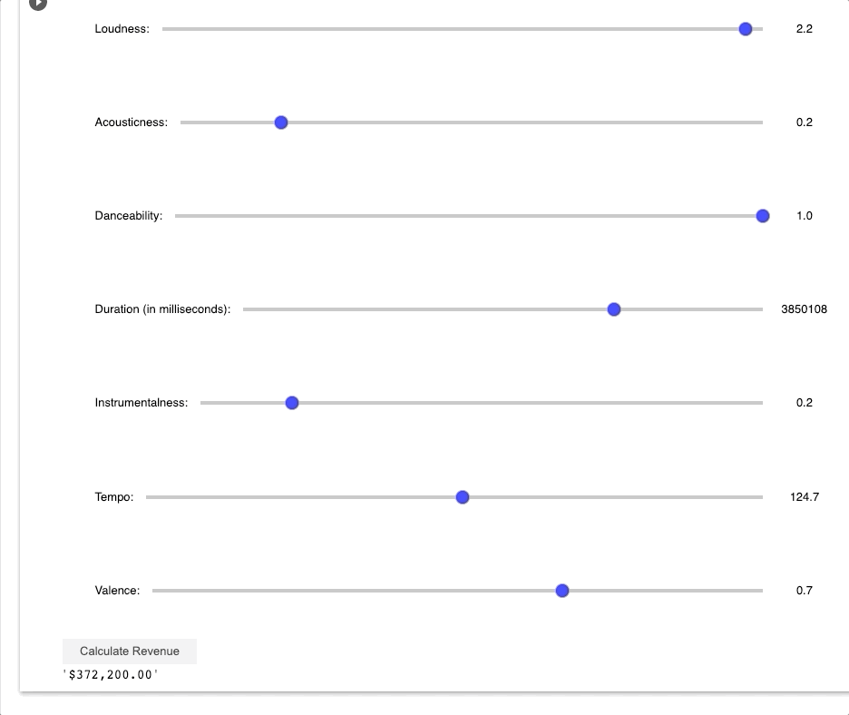
